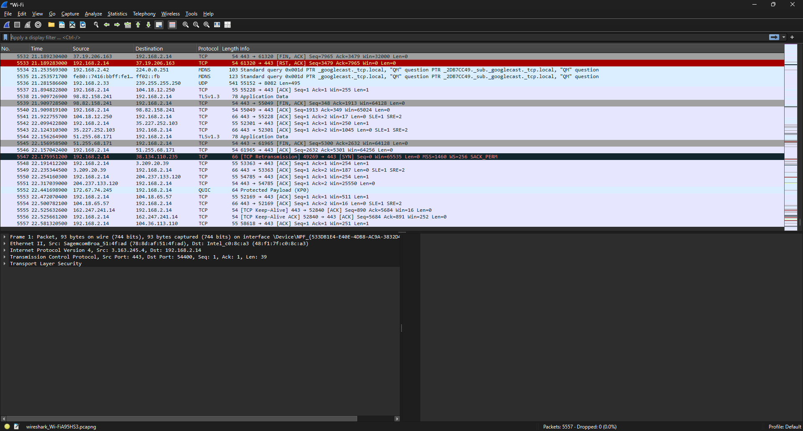
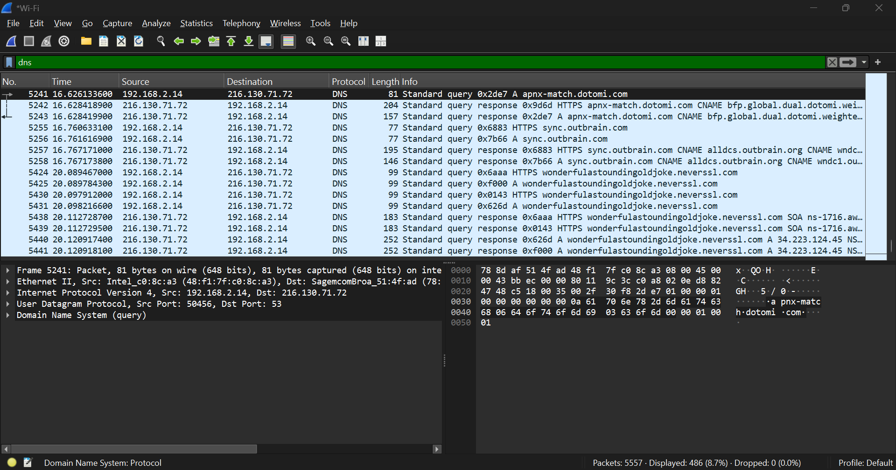
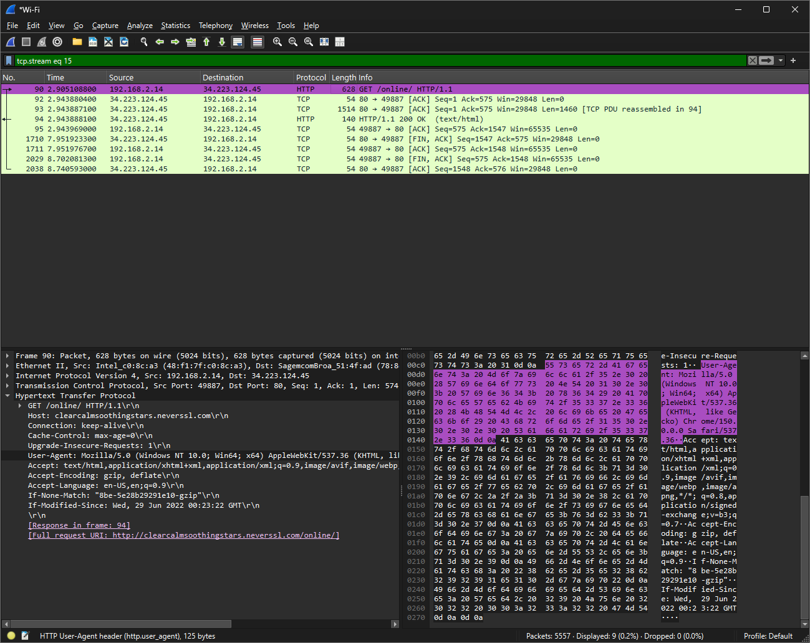
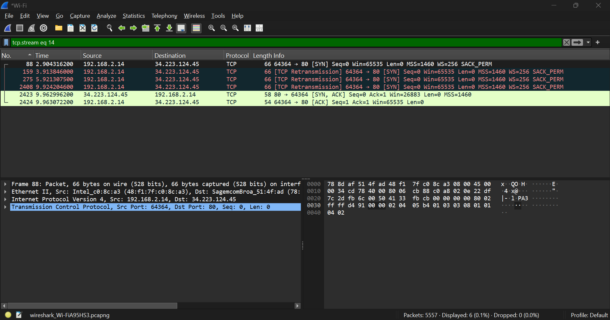

# Network Traffic Analysis - Wireshark

A hands-on packet analysis project using **Wireshark 4.6** to capture and analyze live home network traffic - DNS resolution, plaintext HTTP inspection, TCP handshakes, and a real-world retransmission event with exponential backoff.

## Objective

Build practical packet analysis skills by capturing my own network traffic and using display filters to isolate and interpret protocol behavior - rather than working from a canned .pcap file.

## Lab Setup

| Component | Detail |
|---|---|
| Tool | Wireshark 4.6 with Npcap |
| Host | Windows 11 desktop |
| Interface | Wi-Fi (home network) |
| Capture size | 5,557 packets, 0 dropped (~3 minutes of browsing) |
| Test traffic | Normal HTTPS browsing + a deliberately plaintext HTTP site (neverssl.com) |

## What I Did

### 1. Capture

Captured ~3 minutes of live traffic on the Wi-Fi interface while browsing several sites. Most traffic was **TLSv1.3 / QUIC (encrypted)** - visible metadata (source, destination, ports) but unreadable payloads. This is why I included neverssl.com, a deliberately plain-HTTP site, to have readable application-layer traffic to analyze.

> Key concept: with HTTPS, an observer on the network sees **who** you talk to but not **what** you say. With plain HTTP, they see everything.

### 2. DNS analysis

Filter: `dns`

Isolated DNS query/response pairs and expanded queries in the packet detail pane to read the exact hostnames being resolved. Findings:

- Every new site visit begins with a DNS lookup - a clean record of what names the machine tried to reach.
- Repeat visits generated **no new queries** - the local resolver cache answered them, a good reminder that absence of DNS traffic doesn't mean absence of activity.
- Background queries appeared for domains I never consciously visited (telemetry/CDN lookups).

### 3. HTTP inspection (plaintext)

Filter: `http`

Captured a full HTTP exchange with neverssl.com:

- The **GET request** in cleartext - `Host` header, full `User-Agent` (OS and browser build), `Accept` headers.
- The server's **`HTTP/1.1 200 OK (text/html)`** response.
- Used **Follow → HTTP Stream** to reassemble the complete request/response conversation, including the returned HTML.
- The same stream view also captured the polite connection close (`FIN, ACK` exchange).

### 4. TCP three-way handshake

Filter: `tcp.flags.syn == 1`, then **Follow → TCP Stream** on a connection

Traced a complete connection establishment: `[SYN]` → `[SYN, ACK]` → `[ACK]`, followed by the HTTP request - the greeting that precedes every TCP conversation.

### 5. Retransmission analysis - best finding of the project

Filter: `tcp.analysis.retransmission`

One connection (my host → port 80) told a story:

| Time (s) | Packet | Interpretation |
|---|---|---|
| 2.90 | `[SYN]` | Initial connection attempt - no reply |
| 3.91 | `[TCP Retransmission] [SYN]` | Retry after ~1s |
| 5.92 | `[TCP Retransmission] [SYN]` | Retry after ~2s |
| 9.92 | `[TCP Retransmission] [SYN]` | Retry after ~4s |
| 9.96 | `[SYN, ACK]` | Server finally responds |
| 9.96 | `[ACK]` | Handshake completes - 7 seconds after the first attempt |

Two takeaways:

- **Retransmission is TCP's reliability mechanism in action** - unacknowledged packets are re-sent, never silently dropped.
- **Exponential backoff is visible in the timestamps** - retry gaps double (~1s → ~2s → ~4s) to avoid hammering an unresponsive host. A handful of retransmissions is normal network weather; a spike is a health signal worth investigating (congestion, failing host, or scan traffic hitting non-responsive targets).

## Screenshots

## What I Learned

- **Filters are the skill.** Wireshark's `protocol.field == value` grammar (`tcp.flags.syn == 1`, `tcp.analysis.retransmission`) mirrors SIEM query logic - fetch broadly, then narrow to signal.
- **Encryption changes what analysis is possible.** Metadata analysis (who/when/how much) works on everything; content analysis only works on plaintext protocols.
- **Timing patterns carry meaning.** The retransmission backoff was only visible by reading timestamps, not just packet labels.

## Next Steps

- [ ] Capture and diagram a full TLS handshake (ClientHello / ServerHello / certificate exchange)
- [ ] Analyze a simulated port scan (nmap against a lab VM) and compare its SYN pattern to normal traffic
- [ ] Export flows and correlate with Splunk (companion project: [Splunk_Logs](https://github.com/sh563/Splunk_Logs))
